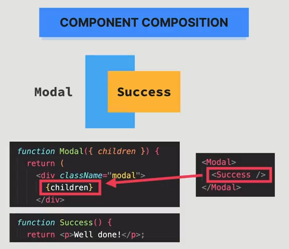

## Component Composition là gì?
Component Composition là một kĩ thuật trong React mà tại đó chúng ta "tái sử dụng" một component bằng cách chèn nó vào một component khác một cách dynamic thông qua biến prop `children`

### Vấn đề hiện tại
Ví dụ: trong đa số các trường hợp, chúng ta muốn tái sử dụng một component, ta chỉ cần chèn nó vào thẳng một component khác như hình dưới đây:

Có thể thấy component `Success` được chèn thẳng vào component `Modal`, đây cũng là một cách tái sử dụng.

Thế nhưng, cách tiếp cận này lại tạo ra một vấn đề khá lớn, đó là component `Success` lúc này bị dính chặt với component `Modal`.

Điều này khiến cho chúng ta không thể tái sử dụng được `Modal`, vì chúng ta về cơ bản đã tạo ra một component mới là `Modal Success`

### Cách giải quyết
Để giải quyết trường hợp trên, chúng ta sẽ tạo ra một "khoảng trống" bên trong `Modal` như hình dưới đây:

Sau đó, khi muốn tạo ra một component khác từ modal, chẳng hạn `Success Modal`, chúng ta sẽ pass component đó vào `Modal` như sau:

Cách tiếp cận này có lợi thế gì? Như dễ dàng thấy được, component `Modal` và `Success` bây giờ không dính chặt lấy nhau, và từ đó chúng ta có thể tạo ra rất nhiều loại Modal khác nhau mà vẫn tái sử dụng lại được `Modal` bằng cách truyền component mới vào prop `children` (chèn vào giữa thẻ `<Modal>....</Modal>`)

### Lợi ích của Component Composition
#### 1. Tăng tính tái sử dụng của các component
#### 2. Giải quyết prop drilling

### *Lưu ý: Kĩ thuật này chỉ khả thi khi component không cần biết Children của nó là gì*