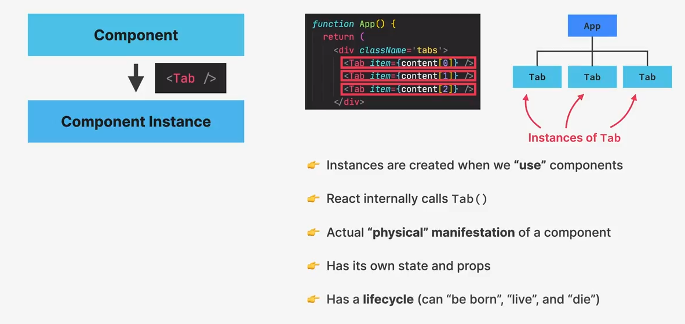
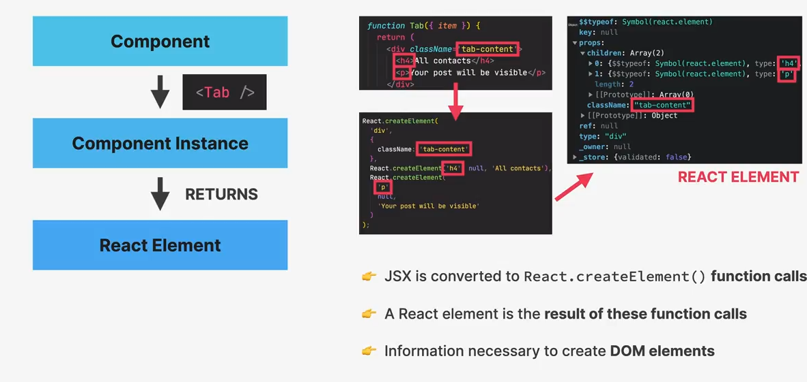

## Khái niệm trong React

### Component là gì?
- Component là mô tả của UI.
- Compoennt là một function **return React element** (hoặc element tree), thường được viết dưới dạng JSX.
- Có thể xem component là **bản vẽ** hoặc **template** để tạo nên các **Component Instance**.

Ví dụ:

Trong ví dụ trên: 
- Component `Tab` tạo ra 3 instance `Tab`.
- Trên thực tế React làm điều này bằng cách gọi hàm `Tab()` 3 lần.
- Trên thực tế, chính các instance này mới nắm giữ state và prop của riêng chúng.
- Các instance này đều có vòng đời nhất định.

> Các thuật ngữ **Component** và **Component Instance** thường được dùng lẫn lộn trong thực tế, nhưng chính xác hơn, Component là "bản vẽ", còn Component Instance là kết quả cụ thể của bản vẽ đó khi được gọi.

### React Element

Khi React thực hiện code bên trong các instance của nó, thì sẽ **return một hoặc nhiều React Element**, lí do:

- Syntax JSX được viết bên trong một instance thường sẽ convert thành một hoặc nhiều **function calls** `React.createElement()`.
- React là thứ sẽ gọi hàm này, và kết quả sinh ra về cơ bản là các immutable object **React Element**.
- Về cơ bản **React Element** chứa tất cả các thông tin cần thiết để tạo ra một **DOM element** cho component instance hiện tại.

Các **React Element** sẽ được convert thành các **DOM element** tương ứng rồi sau đó được inserted vào browser.

Có thể nói, **DOM element** là **kết quả hiển thị cuối cùng** của một React Element trên trình duyệt.

**Lưu ý quan trọng**: React Element là đối tượng bên trong React đại diện cho các DOM element, và nó không được render trực tiếp vào DOM. React Element chỉ đóng vai trò trung gian để giúp React quản lý và cập nhật UI. DOM element là kết quả cuối cùng sau khi React xử lý.

## So sánh với React Native

Về cơ bản, React và React Native giữ nguyên khái niệm cốt lõi về **Component**, **Component Instance** và **React Element**, nhưng cách chúng tương tác với hệ thống nền tảng (platform) là khác nhau. Cụ thể có một sự khác biệt nhỏ giữa chúng trong React Element:

- **React**: React Elements là mô tả của DOM elements (thẻ HTML). Chúng không phải là phần được render mà chỉ là mô tả.
- **React Native**: React Elements mô tả Native Elements (như View, Text, Image), tương ứng với các thành phần giao diện gốc trên Android/iOS.

Điều này dẫn đến sự khác biệt trong **kết quả hiển thị**:
- **React**: Kết quả cuối cùng là DOM elements (thẻ HTML) được chèn vào trình duyệt.
- **React Native**: Kết quả cuối cùng là Native UI elements được hiển thị trên thiết bị (không phải HTML).