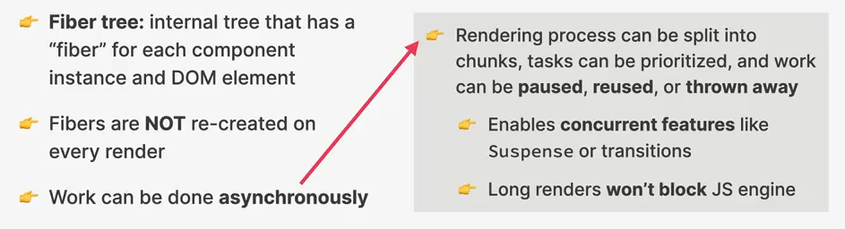

## Khái niệm trong React

### Render Phase

Trước đó, chúng ta đã tìm hiểu **Render được trigger như thế nào**. Bây giờ, chúng ta sẽ tìm hiểu xem **Render được thực hiện như thế nào** trong Render Phase.

- Khi bắt đầu Render Phase, React sẽ đi qua toàn bộ Component Tree, lấy ra Component Instance đã trigger re-render và sau đó render nó bằng cách gọi component function tương ứng mà chúng ta đã định nghĩa bằng code.
- Việc gọi component function sẽ tạo các React Element mới (đã được update), và các React Element này kết hợp với nhau tạo ra một **Virtual DOM** mới.

Vậy **New Virtual DOM** trong sơ đồ là gì?

### Virtual DOM (React Element Tree)

Tại **Initial Render**, React sẽ lấy toàn bộ Component Tree và chuyển đổi nó thành React Element Tree, hay còn gọi là Virtual DOM.

Chi phí tài nguyên của việc tạo và duy trì tree này thực tế khá nhỏ và nhẹ bởi vì tree này về bản chất chỉ là một JavaScript Object đơn thuần.

> Virtual DOM có lẽ là định nghĩa phổ biến nhất mà người ta sẽ dùng khi nói về cách mà React hoạt động, nhưng thực tế, Virtual DOM chỉ là một object đơn thuần, thế nên trong tài liệu chính thức của React, họ không còn dùng khái niệm này nữa.

> Ngoài ra, một số người nhầm lẫn khái niệm này với **Shadow DOM**, nhưng thực tế, Shadow DOM không có gì liên quan đến React, Shadow DOM chỉ là một kĩ thuật mà web browser dùng để tạo ra các web component.

Tiếp theo, chúng ta giả sử rằng component D trong tree xảy ra **state update**, việc này tất nhiên sẽ trigger re-render. Thế nên React sẽ gọi lại function của D, đặt React Element D mới vào React Element Tree

Thế nhưng, chú ý rằng, mỗi khi mà một React Element được render, vỉệc render này sẽ xảy ra trên toàn bộ **child elements** của element đó, bất kể các props có thay đổi hay không. _(trong trường hợp này nghĩa là E cũng sẽ được render)_

Điều này cũng có nghĩa, nếu component A thay đổi, vì A là component root của toàn bộ tree này, điều này đồng nghĩa là quá trình render sẽ xảy ra trên toàn bộ các phần tử trong React Element Tree.

Lí do xảy ra việc này vì React không có cách nào biết được liệu khi một element re-render thì sẽ ảnh hưởng đến child element nào, thế nên quyết định **play-safe** bằng cách render toàn bộ các child element.

Và lưu ý rằng, việc render này không có nghĩa là toàn bộ DOM sẽ được render mà thực tế chỉ có Virtual DOM bị tái tạo lại, điều này không phải là một vấn đề lớn.

- Tại thời điểm này, chúng ta đã biết được **New Virtual DOM** nghĩa là sao, điều sẽ xảy ra tiếp theo là **New Virtual DOM** này sẽ được **Reconciliation** và **Diffing**, 
- Quá trình này được thực hiện bên trong **React Reconciler** hay còn được gọi là **Fiber**, và đó là lí do chúng ta có **Fiber Tree**.
- Kết quả của quá trình **Reconciliation + Diffing** này sẽ cho ra một **Updated Fiber Tree**, là tree sẽ được dùng để viết vào DOM.

### Reconciliation là gì và tại sao chúng ta cần nó?

Đầu tiên cần phải tại sao chúng ta lại cần đến các quá trình phức tạp này để làm gì?

**Sao không đơn giản là update toàn bộ DOM khi state thay đổi? Bởi vì:**
- Việc thay đổi DOM khá là chậm và tốn kém tài nguyên, thế nên luôn luôn cập nhật toàn bộ DOM mỗi khi xảy ra thay đổi về state sẽ là giải pháp không tối ưu.
- Thông thường, mỗi khi một state nào đó trên app thay đổi, chỉ cần một phần của DOM thay đổi, còn các phần còn lại hoàn toàn có thể tái sử dụng.

Thế nên đây là những gì React sẽ làm, mỗi khi có thay đổi về state, React sẽ cố gắng tái sử dụng lại DOM trước đó nhiều nhất có thể.

Thế nhưng việc này dẫn đến câu hỏi kế tiếp rằng:
**React làm như vậy bằng cách nào? Làm sao mà React biết được việc thay đổi sẽ ảnh hưởng đến phần tử nào?**

Đây là lí do chúng ta sẽ cần đến **Reconciliation**, quá trình này về cơ bản sẽ quyết định xem phần tử DOM nào nên được cập nhật, thêm vào, xóa bỏ, vv ... để phản ánh chính xác trạng thái mới của ứng dụng.

Reconciliation được thực hiện nhờ vào **Reconciler**, thế nên chúng ta có thể xem **Reconciler** là engine của toàn bộ React, là trái tim của ứng dụng React. Nhờ vào Reconciler mà chúng ta sẽ không tương tác với DOM một cách trực tiếp nữa.

### Reconciler: Fiber

- Fiber sẽ lấy toàn bộ **React Element Tree** hay **Virtual DOM** và tạo ra **Fiber Tree**.
- Fiber Tree là một cấu trúc cây nội bộ đặc biệt bên trong React mà tại đó ứng với mỗi Componenent Element sẽ có một "fiber".
- Điều đặc biệt của cấu trúc cây này là khác với React Element Tree, Fiber **không tái tạo lại** mỗi lần render. Thực tế đây là một cấu trúc dữ liệu immutable do đó khi nó được tạo ra, nó không bao giờ bị hủy bỏ.
- Thay vào đó, Fiber sẽ được cập nhật liên tục cho những lần re-render sau đó từ khi nó được tạo ra.
- Điều này khiến cho fiber trở thành nơi để theo dõi các thuộc tính của component tương ứng với nó như là state, props, side effects, hooks...
- Hay nói cách khác, các state, props của một component mà chúng ta thấy thực tế được lưu trữ trong Fiber tương ứng của chúng.

Ngoài ra, fiber cũng có một "một hàng đợi công việc" chứa những hàm, những thao tác mà fiber cần thực hiện, điều này khiến cho fiber còn được xem là "Unit of Work".

Ngoài ra, nhìn vào sơ đồ phía trên, chúng ta cũng thấy được Fiber thực tế được thiết kế theo một cấu trúc khác với Component Tree.

Việc này khiến cho mỗi fiber bên cạnh mối tương quan "parent - child" thì còn có một liên kết đến các phần tử siblings, cấu trúc được dùng ở đây là **Linked List**

Việc tái cấu trúc này khiến cho React dễ tương tác hơn đối với mỗi Fiber.

Quay lại với việc Fiber có một **Queue of work**:
- Có một lưu ý rất quan trọng rằng các công việc trong hàng đợi này có thể được thực hiện **bất đồng bộ**:
- Điều này cũng có nghĩa, quá trình render có thể chia thành các cụm, task đơn lẻ với **mức độ ưu tiên** khác nhau cũng như có thể **pause**, **resume** hoặc thậm chí **hủy bỏ** khi cần thiết.
  - Nhờ vậy, các **concurrent features** như là `Suspense` hoặc `transitions` cũng có thể được thực hiện.
  - Các tác vụ render tốn nhiều thời gian cũng sẽ **không block** JS Engine.

### Ví dụ các thao tác trong Reconciliation

Chúng ta xem xét lại ví dụ trước đó như hình dưới đây:

- Đoạn code bên góc tay phải sẽ ứng với Virtual DOM với state showModal = true.
- Cấu trúc cây phía trên sẽ tạo ra được một Fiber Tree tương ứng bên dưới nó.

Lúc này, state showModal được set thành false.

Vì state này nằm ở Component `App`, khiến cho quá trình re-render diễn ra trên toàn bộ cây hiện tại và tạo ra một Virtual DOM mới

Trong Virtual DOM mới, toàn bộ element `Modal` và các con của nó bị biến mất vì showModal = false (xem lại đoạn code phía trên).

Ngoài ra, việc `App` re-render cũng khiến cho hai con của nó là `Video` và `Btn` cũng re-render.

Sau đó, New Virtual DOM sẽ bước vào quá trình **Reconciliation + Diffing** với Fiber Tree hiện tại và cho ra một Fiber Tree mới (tạm gọi là **workInProgress Tree**).

Nhớ rằng, mỗi khi quá trình Reconciliation diễn ra:
- **Fiber** sẽ duyệt qua toàn bộ cây và kiểm tra xem chính xác các phần tử nào cần thay đổi giữa **Current Fiber Tree** và **Updated Fiber Tree** dựa vào **New Virtual DOM**.
- Quá trình so sánh các phần tử dựa vào vị trí của chúng trong cấu trúc cây gọi là **Diffing** (*ta sẽ tìm hiểu quá trình này sau*).

Tiếp theo, hãy phân tích **Updated Fiber Tree** hiện tại:

- Khi showModal thay đổi sang false, thì `Btn` sẽ thay đổi nội dung từ 'Rate' -> 'Hide', thế nên tại `Btn` sẽ xảy ra DOM update (text)

- Khi showModal là false, `Modal` và các phần tử con bên trong nó sẽ không được hiển thị, thế nên tại `Modal` và các con của nó sẽ xảy ra DOM deletions.

- Tại `Video`, tuy quá trình re-render vẫn diễn ra do nó là con của `App`, nhưng thực tế, phần tử này không thay đổi, thế nên kết quả của quá trình Reconciliation đối với phần tử này sẽ là không thay đổi gì trong DOM.

**Tóm lại**:

Đến thời điểm hiện tại, chúng ta biết rằng, kết quả của quá trình **Reconciliation + Diffing** sẽ cho ra một **Updated Fiber Tree** kèm theo đó là một **List of DOM updates** cần thực hiện để thay đổi cấu trúc DOM.

Tại thời điểm này, React vẫn **chưa thay đổi bất kì thứ gì trong DOM**, nhưng nó đã tính toán ra được một thứ gọi là "List of effects", đây sẽ là kết quả cuối cùng của Render Phase - một danh sách các thao tác đến DOM sẽ cần thực hiện tại **Commit Phase**.

## So sánh với React Native

Trong **React Native**, quá trình Render Phase diễn ra tương tự. Tuy nhiên, thay vì tạo ra Virtual DOM, React Native tạo ra một **Native Element Tree**, mô tả các thành phần giao diện người dùng gốc (native) như View, Text, Image cho các nền tảng iOS và Android. Thay vì DOM, các thành phần này sẽ tương tác với các component gốc (native components) của hệ điều hành di động.

### Native Element Tree là gì?

- Cấu trúc này cũng giống như là một **Virtual DOM** nhưng mà là đại diện cho các thành phần giao diện gốc của iOS hoặc Android. React Native sẽ chuyển đổi các component của React thành các Native Component UI tương ứng. 
- Điều này có nghĩa là thay vì làm việc với một Virtual DOM và thực hiện các thay đổi đối với DOM, React Native làm việc với các Native Component UI của nền tảng di động.

Quá trình **Reconciliation** cũng diễn ra với quy tắc tương tự đã nêu ở trên, với sự giúp sức của **Fiber**, chỉ khác là thay vì mục tiêu cuối cùng là thay đổi DOM thì **React Native** nhắm đến việc cập nhật giao diện bằng cách chuyển đổi các thay đổi trong JavaScript thành lệnh gọi gốc (native calls) thông qua Bridge.

### Native Bridge là gì?
- Một yếu tố đặc trưng của **React Native** là **Native Bridge**. Đây là một cầu nối giữa các thread JavaScript (nơi logic React chạy) và UI gốc của thiết bị. Khi React Native thực hiện Reconciliation và xác định các thay đổi, nó sẽ gửi thông tin qua Native Bridge để các native component tương ứng thực hiện các thay đổi giao diện.

- So với web, nơi mà các thay đổi chỉ tác động lên DOM, thì trong React Native các thay đổi sẽ đi qua bridge này để tác động lên giao diện gốc, dẫn đến trải nghiệm UI mượt mà và tự nhiên hơn.
