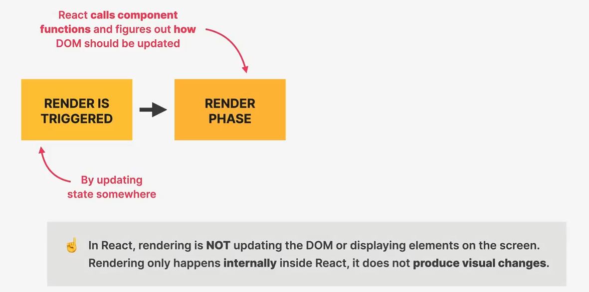
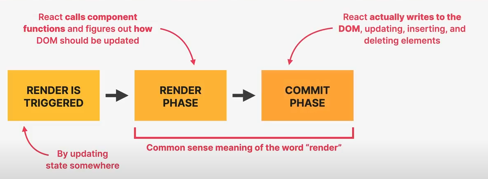
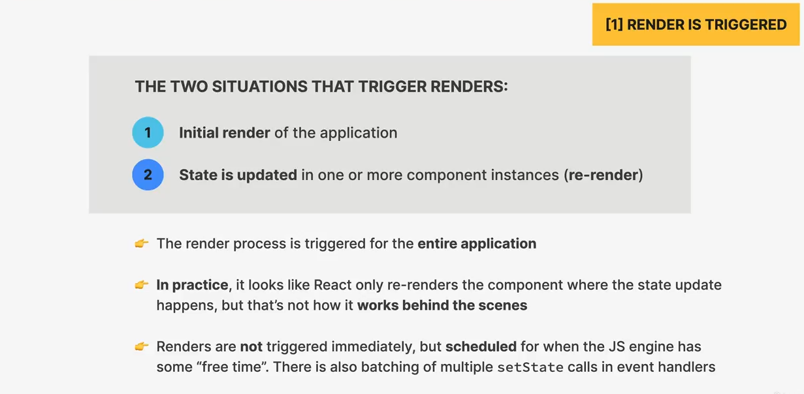

## Khái niệm trong React

### Sơ lược - Component được hiển thị trên giao diện như thế nào?

- Đầu tiên, chúng ta cần biết rằng, việc hiển thị component trên giao diện được bắt đầu là do **quá trình render** được kích hoạt (trigger) vì một lí do nào đó. Đa số là do **state thay đổi**.
- Giai đoạn tiếp theo khi quá trình render được kích hoạt có thể tạm gọi là **Render Phase**, tại phase này, React gọi các **component function** và xác định xem DOM **nên được update như thế nào**. 
- Tuy nhiên, React **không update DOM tại phase này**, mà thực sự quá trình render hoạt động đằng sau khác với những gì nmà chúng ta nghĩ khi nói về việc 'render' trong React.
- Trong React, việc render **không phải** là update DOM hay hiển thị elemen trên giao diện. Render chỉ xảy ra **nội bộ bên trong** React, chứ **không tạo ra thay đổi về thị giác**.
  

- Thực tế, 'render' mà chúng ta hay nói đến thực chất là kết hợp giữa **Render Phase** và phase phía sau nó, có thể gọi là **Commit phase**.

- Tại **Commit phase**, React mới thật sự viết vào DOM, update, insert hoặc delete các phần tử của DOM.

Và cuối cùng, browser sẽ phát hiện được những thay đổi trong DOM và sẽ 'tự vẽ' lại, và tạo ra các thay đổi về thị giác cho người dùng. (Thực sự thì quá trình này không còn liên quan đến React nữa).

### Render được trigger như thế nào?

Có hai tình huống mà Render được trigger:
1. **initial render** cho chương trình.
2. **state bị thay đổi** ở một hai nhiều component instances (hay **re-render**).

👉 Điều quan trọng cần chú ý là render process sẽ được trigger **trên toàn bộ ứng dụng**.

👉 Ý trên không có nghĩa là toàn bộ **DOM** được update, mà chỉ là render process được trigger trên toàn bộ ứng dụng, gọi các component functions, tính toán xem thứ gì cần thay đổi trong DOM sau đó.

👉 Trên thực tế, chúng ta thấy React trông như chỉ render lại phần tử mà có thay đổi, nhưng không phải vậy.

👉 Ngoài ra, render **không** trigger ngay lập tức, mà sẽ được **lập lịch** để khi mà JS Engine có "free time" thì mới bắt đầu.

## So sánh với React Native

- Cơ chế render cũng tương tự: **Render Phase** và **Commit Phase**. Tuy nhiên, thay vì DOM, React Native không tương tác với DOM mà tương tác với Native Elements (View, Text, etc.).
- Ở Commit Phase, React Native sẽ gửi các thay đổi về UI (như insert, update, delete) cho **Native Modules** (lớp trung gian), và lớp này sẽ thực hiện việc hiển thị Native UI tương ứng.
- Sự khác biệt lớn nhất vẫn là React Native không làm việc với trình duyệt mà với UI gốc của nền tảng Android/iOS.